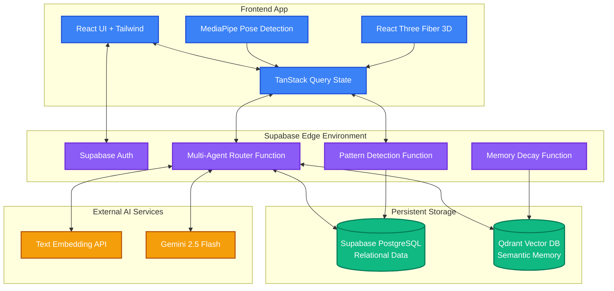
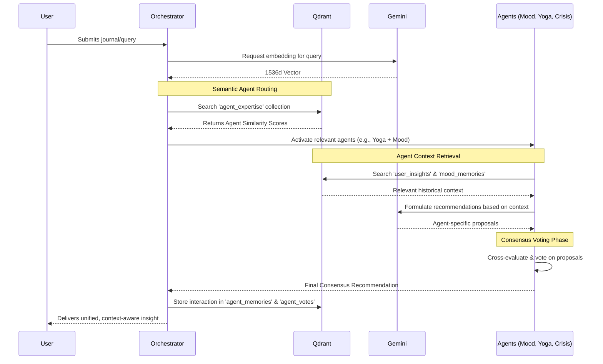
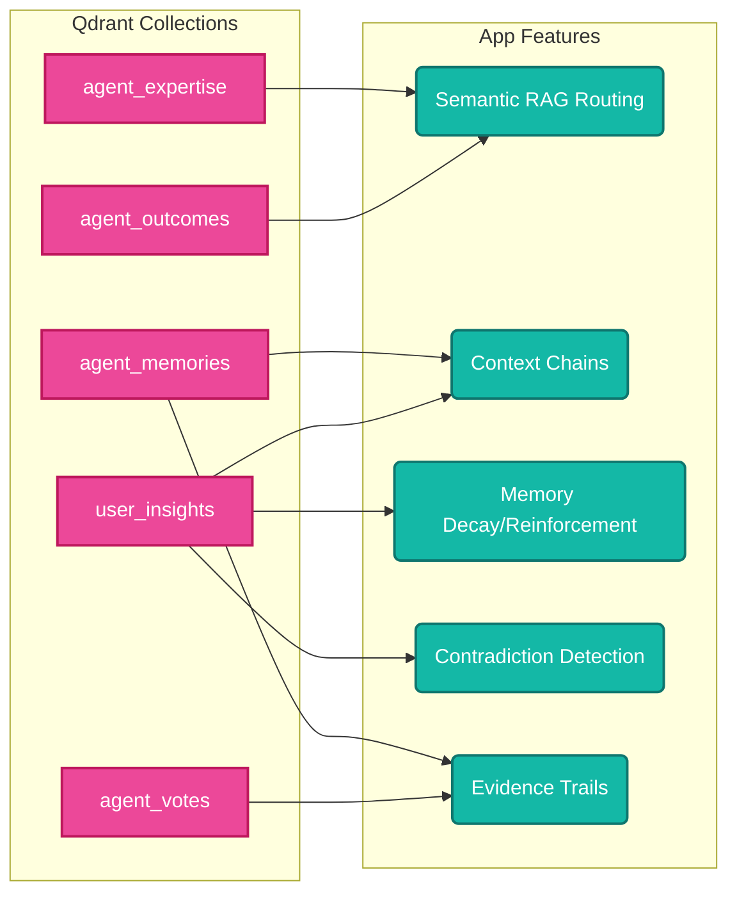

# Mindful Flow Hub

<div align="center">
  <h3>Your AI-Powered Wellness Companion with Long-Term Memory</h3>
</div>

---

## Table of Contents
1. [The Problem](#1-the-problem)
2. [The Solution](#2-the-solution)
3. [Innovation](#3-innovation)
4. [Features](#4-features)
5. [User Journey](#5-user-journey)
6. [System Architecture](#6-system-architecture)
7. [Workflow & Orchestration](#7-workflow--orchestration)
8. [Data Flow & State Management](#8-data-flow--state-management)
9. [Tech Stack](#9-tech-stack)
10. [AI Deep Dive — Gemini 2.5 Flash](#10-ai-deep-dive--gemini-25-flash)
11. [Impact](#11-impact)
12. [Real-World Use Cases](#12-real-world-use-cases)
13. [Comparison](#13-comparison)
14. [Scalability](#14-scalability)
15. [Responsible AI and Ethics](#15-responsible-ai-and-ethics)
16. [Evaluation Criteria Alignment](#16-evaluation-criteria-alignment)
17. [Trade-offs](#17-trade-offs)
18. [Project Complexity Tiers](#18-project-complexity-tiers)
19. [Installation & Setup](#19-installation--setup)
20. [Why This Will Win](#20-why-this-will-win)
21. [Future Scope](#21-future-scope)
22. [FAQ](#22-faq)
23. [Lessons Learned](#23-lessons-learned)

---

## 1. The Problem
Mental wellness journeys are often fragmented. Users switch between mood trackers, yoga apps, journaling tools, and crisis resources, creating isolated data silos. Existing AI mental health tools often lack long-term memory, meaning users must repeatedly explain their context, leading to frustrating and generic experiences that fail to recognize evolving temporal and emotional patterns.

## 2. The Solution
**Mindful Flow Hub** is a cohesive, AI-driven wellness ecosystem. By integrating mood tracking, physical wellness (yoga/breathing), interactive therapeutic games, and multimodal journaling (voice and text) into a single platform backed by a highly optimized **Qdrant Vector Database**, the system builds a deeply personalized, evolving knowledge graph of the user's mental health.

## 3. Innovation
- **Multi-Agent Wellness System**: A collaborative swarm of specialized AI agents (`Mood Analyst`, `Yoga Coach`, `Crisis Detector`, and `Orchestrator`) that use a semantic routing system (RAG Router) and a consensus-based voting mechanism to generate highly personalized recommendations.
- **Extensive Qdrant Integration**: Moving far beyond simple vector storage, Qdrant acts as the system's "hippocampus." It handles semantic routing, evidence trails, contradiction detection, and mathematical memory decay/reinforcement.
- **On-Device Pose Detection**: Real-time computer vision (MediaPipe) running locally in the browser to provide immediate feedback on physical wellness activities like Yoga.

## 4. Features
- **Intelligent Mood Tracking & Pattern Detection**: Discovers cyclical (daily/weekly/monthly/seasonal) mood patterns.
- **Multimodal Journaling**: Supports both text and voice entries with real-time AI transcription and emotion analysis.
- **Therapeutic Games**: Cognitive Behavioral Therapy (CBT)-inspired exercises like Breathing, Memory Match, Shell Game, Word Flow, and Mood Colors.
- **AI-Guided Yoga & Pose Detection**: Real-time CV feedback on asanas with personalized recommendations based on physical and mental state.
- **Memory Health & Decay**: Natural fading of old insights unless reinforced, mimicking human memory and prioritizing relevant recent context.
- **Evidence Trails**: Full transparency into AI decision-making, showing exactly which memories (Qdrant vectors) influenced a recommendation.

## 5. User Journey
1. **Onboarding**: User creates a profile and begins exploring therapeutic games or logging their mood.
2. **Engagement**: User practices yoga with real-time CV feedback or records a voice journal.
3. **Synthesis**: The Multi-Agent system analyzes new inputs, storing embeddings in Qdrant.
4. **Insight Delivery**: User visits the dashboard to view detected temporal patterns, AI consensus recommendations, and memory health.
5. **Crisis Intervention**: If severe negative sentiment is detected, the Crisis Detector agent overrides standard routing to surface immediate support resources.

## 6. System Architecture

The architecture seamlessly blends client-side heavy computing (for privacy and real-time CV) with serverless edge functions and a dual-database approach (Relational + Vector).



### The Role of Qdrant in Architecture
Qdrant is the cornerstone of the system's "intelligence." While Supabase Postgres handles structured data (user profiles, raw mood scores), Qdrant handles the *meaning* behind that data. Every text input, voice transcription, and AI-generated insight is converted to a 1536-dimensional vector and stored in specialized Qdrant collections.

## 7. Workflow & Orchestration

The system orchestrates a swarm of agents through a **Semantic RAG Router**, entirely powered by Qdrant similarity searches.



### Agent Expertise Routing via Qdrant
Instead of hardcoding rules for which AI agent handles a task, the orchestrator generates an embedding of the user's query and compares it against the `agent_expertise` vectors stored in Qdrant. If the similarity passes a threshold (e.g., >0.35), the agent is activated. The `Crisis Detector` runs continuously to monitor for safety.

## 8. Data Flow & State Management

### Extensive Qdrant Usage & Collections Map
Qdrant usage goes far beyond standard RAG. The system leverages multiple distinct vector collections to power complex cognitive behaviors:



1. **`agent_expertise`**: Stores base embeddings for each agent's domain knowledge.
2. **`agent_memories`**: Stores the raw insights generated by agents, allowing the system to recall *what the AI thought in the past*.
3. **`agent_outcomes` & `agent_votes`**: Stores user feedback on recommendations. Agents learn from past successes by querying similar vectors in `agent_outcomes`.
4. **Context Chains & Contradiction Detection**: Qdrant's vector math is used to find "opposite" vectors. If a new memory vector has a negative cosine similarity to a stored insight, the system flags a "Contradiction," prompting the AI to rethink its assumptions about the user.
5. **Mathematical Memory Decay**: Vector payloads in Qdrant store a `decay_factor`. Over time, a cron-job modifies this factor unless the memory is repeatedly retrieved (reinforced). This prevents the AI from getting stuck on outdated user preferences.

## 9. Tech Stack
- **Frontend**: React 18, TypeScript, Vite, Tailwind CSS, shadcn/ui, Radix UI.
- **AI & ML**: Gemini 2.5 Flash, MediaPipe (Pose Detection), Lovable AI Gateway.
- **Backend & Auth**: Supabase (Auth, Postgres, Edge Functions).
- **Vector Database**: Qdrant.
- **Animation & 3D**: Framer Motion, React Three Fiber.

## 10. AI Deep Dive — Gemini 2.5 Flash
The project utilizes **Google's Gemini 2.5 Flash** for its exceptional speed and multimodal capabilities. Gemini powers:
- The Multi-Agent consensus voting and reasoning.
- Emotion extraction from voice and text journals.
- Contradiction detection logic (analyzing opposing vectors from Qdrant).
- Generation of the transparent Evidence Trails.

Its massive context window and rapid response times make the complex, multi-agent synchronous workflow—requiring multiple round-trips to Qdrant—possible in near real-time.

## 11. Impact
Mindful Flow Hub democratizes access to personalized, AI-driven mental wellness tools. By remembering past interactions natively in Qdrant, it builds a therapeutic alliance with the user, reducing the cognitive load of tracking one's own mental health and providing timely, context-aware interventions.

## 12. Real-World Use Cases
- **Chronic Stress Management**: Identifying that a user's stress peaks on Thursday evenings and proactively recommending a 10-minute targeted yoga flow.
- **Anxiety Tracking**: Connecting an increase in resting heart rate (logged via activities) with negative voice journal sentiments to prompt grounding exercises (Breathing/Colors).
- **Progress Validation**: Showing a user an "Evidence Trail" of how their mood has demonstrably improved over three months of consistent yoga practice.

## 13. Comparison
| Feature | Mindful Flow Hub | Traditional Wellness Apps | Basic AI Chatbots |
|---------|-----------------|---------------------------|-------------------|
| **Memory** | Long-term, semantic (Qdrant), dynamic mathematical decay | None / Static structured data | Short-term context window |
| **Personalization** | Multi-agent consensus based on deep vector history | Rule-based (if X then Y) | Generic prompt-based |
| **Transparency** | Explains reasoning via Qdrant Evidence Trails | Black box | Black box |
| **Multimodality** | Voice, Text, Computer Vision (Pose) | Usually just text/buttons | Text only |

## 14. Scalability
- **Serverless Edge**: Supabase Edge functions scale automatically with usage.
- **Qdrant Vector DB**: Built for high-throughput, billion-scale vector search, ensuring rapid retrieval even as the user's semantic memory graph grows exponentially.
- **Client-Side Compute**: MediaPipe pose detection runs entirely in the browser, offloading heavy CV compute from the server and ensuring privacy.

## 15. Responsible AI and Ethics
- **Privacy First**: Sensitive physical health data (camera feed) is processed locally on-device; images are never sent to the server.
- **Crisis Override**: The system recognizes its limits. If self-harm or severe crisis semantics are detected in Qdrant similarity searches, the AI steps back and routes the user to human emergency resources.
- **Transparency**: Users can view exactly what the AI knows about them and inspect the semantic links (Context Chains) forming the AI's conclusions via the Evidence Trails component.

## 16. Evaluation Criteria Alignment
- **Technical Complexity**: High. Implements a multi-agent system, Qdrant semantic router, memory decay algorithms, and on-device CV.
- **Originality**: Moving beyond standard chatbots to a unified, context-aware wellness ecosystem with true long-term memory.
- **Design & UX**: Premium, glassmorphism UI with fluid micro-interactions and therapeutic color palettes.

## 17. Trade-offs
- **Latency vs. Consensus**: Running a multi-agent voting system with multiple Qdrant queries adds slight latency compared to a single LLM call. This was mitigated by using the ultra-fast Gemini 2.5 Flash model and optimizing Qdrant index parameters.
- **Client Bundle Size**: Shipping MediaPipe and Three.js increases initial load time, offset by the privacy and cost benefits of client-side processing.

## 18. Project Complexity Tiers
This project falls into the **Advanced/Expert Tier**, integrating disparate technologies (Advanced Vector DBs, Edge AI, Client-side CV, WebGL 3D, and complex asynchronous state orchestration).

## 19. Installation & Setup
1. Clone the repository.
2. Install dependencies: `npm install`
3. Configure environment variables in `.env`:
   ```env
   VITE_SUPABASE_URL=your_supabase_url
   VITE_SUPABASE_ANON_KEY=your_supabase_anon_key
   QDRANT_URL=your_qdrant_url
   QDRANT_API_KEY=your_qdrant_api_key
   LOVABLE_API_KEY=your_lovable_api_key
   ```
4. Run the development server: `npm run dev`
5. Deploy Edge Functions: `supabase functions deploy`

## 20. Why This Will Win
Mindful Flow Hub isn't just an app; it's a demonstration of how AI *should* interact with highly personal data. By pioneering transparent AI (Evidence Trails) and mimicking human cognition (Memory Decay, Context Chains) powered by the extreme performance of Qdrant, it represents the next generation of empathetic, context-aware computing.

## 21. Future Scope
- **Wearable Integration**: Syncing with Apple Health / Google Fit for biometric context (HRV, Sleep stages).
- **Proactive Interventions**: Push notifications triggered by predictive temporal pattern analysis in Qdrant.
- **Expanded Agent Swarm**: Adding specialized agents for nutrition, sleep hygiene, and productivity.

## 22. FAQ
**Q: Is my camera data saved?**
A: No. All pose detection processing happens entirely in your browser using MediaPipe. No video or images are sent to our servers.

**Q: How does the AI remember me?**
A: We use Qdrant, an advanced vector database, to store mathematical representations (embeddings) of your sessions, journaling, and feedback, enabling the AI to "remember" semantics over years.

**Q: What happens if I'm in a crisis?**
A: The system's Crisis Detector agent constantly monitors inputs with high priority. If risk is detected, it overrides standard responses to provide immediate emergency resources and hotlines.

## 23. Lessons Learned
- **Orchestrating Multiple Agents**: Managing state and consensus among multiple LLM calls requires robust error handling and fallback mechanisms.
- **Semantic Search Nuances**: Negative similarity search in Qdrant (for Contradiction Detection) requires careful prompt engineering to ensure the AI correctly interprets mathematical opposites as logical contradictions.
- **The Value of Transparency**: Building the "Evidence Trail" feature proved that showing users *why* an AI made a suggestion dramatically increases trust in the platform.
